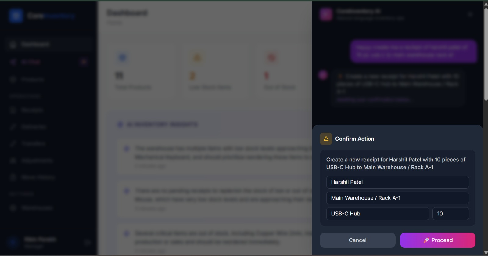
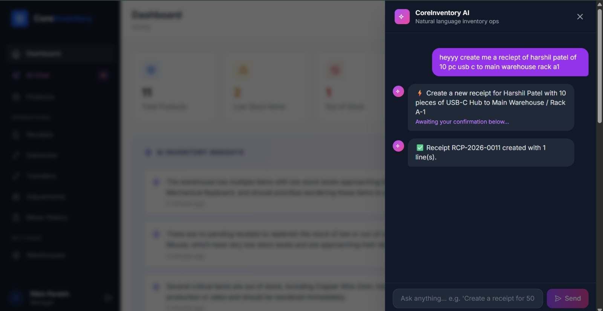
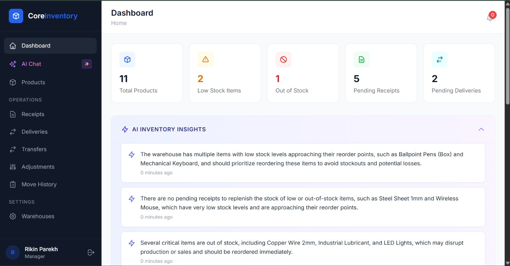
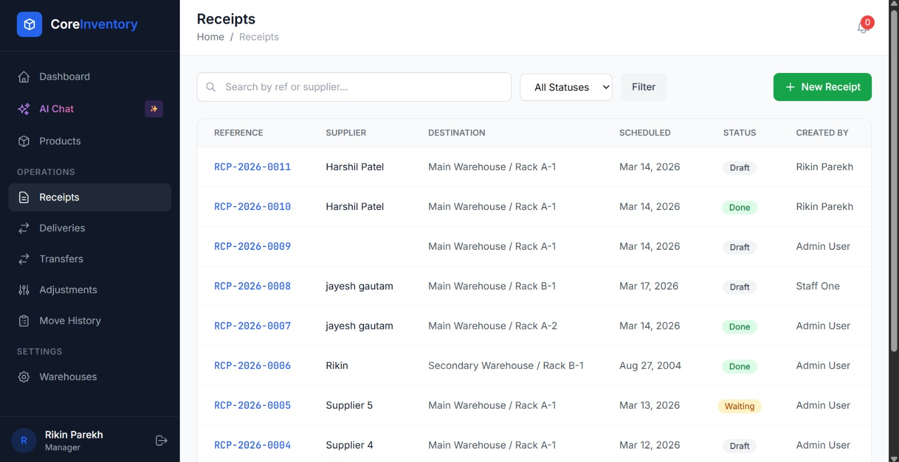
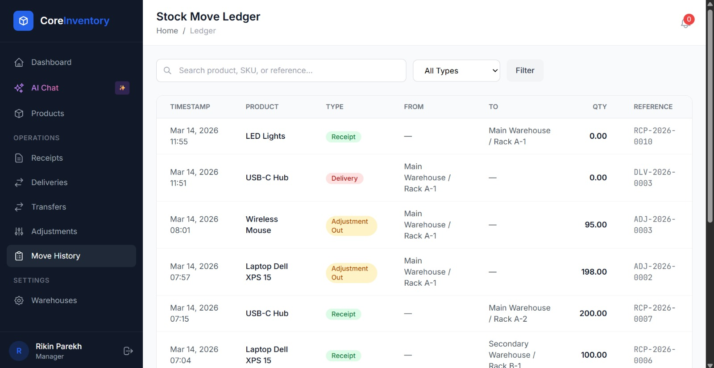

# 📦 CoreInventory: AI-Powered Smart Inventory Management

**CoreInventory** is a cutting-edge, comprehensive inventory and warehouse management system designed to streamline supply chain operations, track stock movements with surgical precision, and leverage Artificial Intelligence to optimize decision-making.

Built with real-world warehousing in mind, CoreInventory maps physical stock adjustments, receipts, and deliveries to a digital ledger, providing businesses with total visibility and control from a single centralized dashboard—all supercharged by a built-in AI assistant.

---

## 🌟 Key Differentiating Features

### 🤖 AI-Powered Warehouse Assistant (Groq LLM Integration)
CoreInventory isn't just a ledger; it actively helps you manage your warehouse. Our native integration with **Groq (Llama 3 70B)** provides unprecedented capabilities:
- **Conversational Queries:** Ask the AI in plain English: *"How many Steel Rods are in Warehouse A?"* or *"Show me low stock items."*
- **Action Generation:** The AI can autonomously draft system actions based on natural language commands. Tell it to *"Create a receipt for 50 pieces of Copper wire from Vendor X"* and it will parse your request into a structured database action awaiting your confirmation.
- **Proactive Insights:** The AI continuously analyzes your stock levels, pending receipts, and delivery burdens, auto-generating real-time, actionable insights and warnings directly to your dashboard alerts.




### 🔐 Advanced Authentication & Security (OTP Support)
Security is paramount when handling business assets. CoreInventory employs deep access control:
- **User Registration & Login:** Email-first authentication structure.
- **OTP-Based Setup & Recovery:** Secure password resets and identity verification using One-Time Passwords directly to user emails.
- **Role-Based Access Control (RBAC):** Granular permissions ensuring users can only view or modify elements (like validating a receipt or accessing financial ledgers) if they possess the exact assigned administrative rights.
- **Warehouse-Specific Scoping:** Users can be restricted to only viewing and operating within their assigned physical warehouse.

---

## 📊 The Command Center Dashboard

The landing page acts as the operational nerve center, providing a high-level snapshot of current inventory health alongside AI intelligence.



### 📈 Core Key Performance Indicators (KPIs)
- **Total Products in Stock:** Real-time visibility of total aggregate inventory.
- **Low Stock & Out of Stock:** Immediate numeric alerts for critical inventory depletion.
- **Pending Receipts / Deliveries:** Awaiting supplier shipments and outbound customer orders.
- **Internal Transfers Scheduled:** Overview of domestic stock moving between racks or buildings.

### 🔍 Dynamic Smart Filters
Quickly sort and find operational data via robust filtering frameworks:
- **By Document Type:** Receipts / Delivery / Internal / Adjustments
- **By Workflow Status:** Draft, Waiting, Ready, Done, Canceled
- **By Location/Warehouse:** Pinpoint stock across different geographical entities.
- **By Product Category:** Filter items based on organizational configurations.

---

## 🗺️ Navigation & Core Modules Structure

The system is logically segmented to entirely eliminate operational friction.

### 1. 🏷️ Product Management
- **Extensive Cataloging:** Create products detailing Name, SKU, descriptions, and assigned Unit of Measure (liters, pieces, kg, etc.).
- **Categorization:** Group products logically (e.g., Raw Materials vs. Finished Goods).
- **Automated Reordering Rules:** Set specific "Reorder Points" per product. When stock dips below this limit, it triggers system alerts and AI insights.
- **Live Stock Mapping:** View exactly how many units exist in every specific bin or location globally.

### 2. 🚛 Receipts (Incoming Goods)
Manage stock arriving from external suppliers.
- **The Flow:** Create Draft → Add Supplier & Items → Awaiting Arrival → Validate Receipt.
- **Result:** System automatically augments the available stock in the destination location and logs the transaction in the Ledger.



### 3. 📦 Delivery Orders (Outgoing Goods)
Manage outbound fulfillment to clients or sales channels.
- **The Flow:** Create Draft → Assign Customer & Items to Pick → Pack → Validate Delivery.
- **Result:** Stock is instantly decremented from the source location, ensuring you never accidentally sell stock you no longer possess.

### 4. 🔄 Internal Transfers
Operate gracefully across complex enterprise domains by moving stock *without* changing total net company assets.
- **Use Cases:** Shift items from "Receiving Dock" to "Storage Rack A", or move goods from "Warehouse New York" to "Warehouse Boston".
- **Result:** Keeps the digital map perfectly aligned with physical reality.

### 5. ⚖️ Stock Adjustments (Audits & Reconciliations)
Fix mismatches between digital records and reality due to damage, shrinkage, theft, or counting errors.
- **The Flow:** Select Location & Product → Enter absolute physical count → Select Reason Code.
- **Result:** System calculates the differential, updates the stock, and logs the variance logic for management review.

### 6. 📖 The Stock Ledger (Audit Trail)
The unalterable backbone of the system.
- Every time an item arrives, leaves, shifts, or is adjusted, a permanent **Stock Move** record is generated. 
- Guarantees 100% traceability for accounting and auditing purposes.



---

## 📘 Simplified Example: The Inventory Flow

Here is exactly how CoreInventory effortlessly handles day-to-day warehouse operations:

1. **Receive Goods:** A vendor delivers 100 kg of Steel.
   *Action:* Validate Receipt. -> *Stock: +100 kg.*
2. **Stage for Production:** Move Steel from the dock to the cutting floor.
   *Action:* Validate Internal Transfer. -> *Net Stock Unchanged; Location Updated.*
3. **Fulfill Customer Sales:** Customer buys manufactured steel frames utilizing 20 kg of steel.
   *Action:* Validate Delivery Order. -> *Stock: -20 kg.*
4. **Audit & Shrinkage:** A worker accidentally damages 3 kg of steel.
   *Action:* Execute Stock Adjustment. -> *Stock: -3 kg.*

*Every single action in this 4-step real-world flow is immutably documented inside the **Stock Ledger**, providing perfect clarity for auditors and AI analysis.*

---

## 💻 Local Development Setup

Follow these instructions to run the application locally on your machine.

### Prerequisites
- **Python 3.10+** installed
- **Redis Server** installed and running (for Celery background tasks)
- **Git**

### 1. Clone the Repository
```bash
git clone https://github.com/your-username/Odoo-CoreInventory.git
cd Odoo-CoreInventory
```

### 2. Create the Virtual Environment & Install Dependencies
```bash
python3 -m venv venv

# On Windows:
venv\Scripts\activate
# On macOS/Linux:
source venv/bin/activate

pip install -r requirements.txt
```

### 3. Configure Environment Variables
Create a file named `.env` in the root folder (`Odoo-CoreInventory/.env`). Add the following mandatory keys:

```ini
SECRET_KEY=generate_a_secure_key
DEBUG=True
ALLOWED_HOSTS=localhost,127.0.0.1

# Default SQLite config for local testing (No Postgres required)
DATABASE_URL=sqlite:///db.sqlite3

# Redis broker for background tasks
REDIS_URL=redis://localhost:6379/0

# (Optional) Email settings for OTP features
EMAIL_BACKEND=django.core.mail.backends.smtp.EmailBackend
EMAIL_HOST=smtp.gmail.com
EMAIL_PORT=587
EMAIL_USE_TLS=True
EMAIL_HOST_USER=your_email@gmail.com
EMAIL_HOST_PASSWORD=your_app_password

# (Mandatory for AI features)
GROQ_API_KEY=your_groq_api_key_here
```

### 4. Run Database Migrations
Set up your local SQLite database structure.
```bash
python manage.py makemigrations
python manage.py migrate
```

### 5. Running the Application Stack
Since this application utilizes background tasks for the AI and email sending, you must run three separate processes in three different terminal windows (ensure your virtual environment is activated in all of them).

**Terminal 1:** Run the Django Server
```bash
python manage.py runserver
```

**Terminal 2:** Run the Celery Worker (Executes tasks)
```bash
# On Windows, you may need to use gevent/eventlet, or use WSL
celery -A config worker -l info
```

**Terminal 3:** Run the Celery Beat (Schedules recurring AI Insight tasks)
```bash
celery -A config beat -l info
```

### 6. Create Superuser & Access Dashboard
In a new terminal:
```bash
python manage.py createsuperuser
```
Follow the prompts, then navigate to `http://localhost:8000` in your web browser and login!
